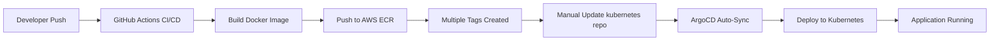

# GitOps Deployment Analysis for Chores-Tracker

## Overview

This document provides a comprehensive analysis of the GitOps deployment infrastructure used for the Chores-Tracker application. The deployment follows industry best practices with a clear separation between application development and infrastructure configuration.

## Repository Architecture

### Dual Repository Pattern
- **Application Repository**: [`github.com/arigsela/chores-tracker`](https://github.com/arigsela/chores-tracker)
  - Contains application source code
  - Handles CI/CD for building and pushing container images
  - Manages semantic versioning and releases
  
- **Infrastructure Repository**: [`github.com/arigsela/kubernetes`](https://github.com/arigsela/kubernetes)
  - Contains Kubernetes deployment configurations
  - Manages GitOps workflows via ArgoCD
  - Handles environment-specific configurations

## Deployment Pipeline

### High-Level Flow



### Detailed Pipeline Steps

1. **Source Code Changes**
   - Developer pushes to `main` branch or creates a release
   - GitHub Actions workflow triggers automatically

2. **Container Build & Push**
   - Docker multi-stage build process
   - Image pushed to AWS ECR with multiple tags:
     - Semantic versions: `v3.0.0`, `v3.0`, `v3`
     - Latest: `latest` (for main branch)
     - SHA: `sha-abc1234`
     - Timestamp: `build-20250627-123456`
     - Branch name: `main`

3. **Infrastructure Update**
   - Manual update to `base-apps/chores-tracker/deployments.yaml`
   - Specify new image version
   - Commit and push to kubernetes repository

4. **Automated Deployment**
   - ArgoCD detects changes via webhook/polling
   - Synchronizes desired state with cluster
   - Performs rolling update of pods

## Key Infrastructure Components

### 1. ArgoCD Configuration

**Application Definition** (`base-apps/chores-tracker.yaml`):
```yaml
apiVersion: argoproj.io/v1alpha1
kind: Application
metadata:
  name: chores-tracker
  namespace: argo-cd
spec:
  project: default
  source:
    repoURL: https://github.com/arigsela/kubernetes
    targetRevision: main
    path: base-apps/chores-tracker
  destination:
    server: https://kubernetes.default.svc
    namespace: chores-tracker
  syncPolicy:
    automated:
      prune: true      # Remove resources not in Git
      selfHeal: true   # Revert manual changes
    syncOptions:
      - CreateNamespace=true
```

### 2. Deployment Configuration

**Current Deployment** (`base-apps/chores-tracker/deployments.yaml`):
```yaml
apiVersion: apps/v1
kind: Deployment
metadata:
  name: chores-tracker
  namespace: chores-tracker
spec:
  replicas: 1
  selector:
    matchLabels:
      app: chores-tracker
  template:
    metadata:
      labels:
        app: chores-tracker
    spec:
      containers:
      - name: chores-tracker
        image: 852893458518.dkr.ecr.us-east-2.amazonaws.com/chores-tracker:3.0.0
        imagePullPolicy: IfNotPresent
        ports:
        - containerPort: 8000
        envFrom:
        - configMapRef:
            name: chores-tracker-config
        - secretRef:
            name: chores-tracker-secrets
        readinessProbe:
          httpGet:
            path: /api/v1/healthcheck
            port: 8000
          initialDelaySeconds: 30
          periodSeconds: 5
      imagePullSecrets:
      - name: ecr-registry
```

### 3. Configuration Management

#### ConfigMap (`configmaps.yaml`)
```yaml
apiVersion: v1
kind: ConfigMap
metadata:
  name: chores-tracker-config
  namespace: chores-tracker
data:
  ENVIRONMENT: "production"
  DEBUG: "False"
  BACKEND_CORS_ORIGINS: "https://chores.arigsela.com"
```

#### External Secrets (`external_secrets.yaml`)
```yaml
apiVersion: external-secrets.io/v1beta1
kind: ExternalSecret
metadata:
  name: chores-tracker-secrets
  namespace: chores-tracker
spec:
  refreshInterval: "1h"
  secretStoreRef:
    name: vault-backend
    kind: SecretStore
  target:
    name: chores-tracker-secrets
  data:
    - secretKey: DATABASE_URL
      remoteRef:
        key: chores-tracker
        property: database-url
    - secretKey: SECRET_KEY
      remoteRef:
        key: chores-tracker
        property: secret-key
    - secretKey: DB_PASSWORD
      remoteRef:
        key: chores-tracker
        property: db-password
```

### 4. Networking Configuration

#### Service (`services.yaml`)
```yaml
apiVersion: v1
kind: Service
metadata:
  name: chores-tracker
  namespace: chores-tracker
spec:
  type: ClusterIP
  ports:
  - port: 80
    targetPort: 8000
  selector:
    app: chores-tracker
```

#### Ingress (`ingress.yaml`)
```yaml
apiVersion: traefik.containo.us/v1alpha1
kind: IngressRoute
metadata:
  name: chores-tracker
  namespace: chores-tracker
spec:
  entryPoints:
    - web
  routes:
  - match: Host(`chores.arigsela.com`)
    kind: Rule
    services:
    - name: chores-tracker
      port: 80
```

### 5. Database Infrastructure

Managed via Crossplane CRDs (`crossplane_resources.yaml`):
- **Database**: `chores-db`
- **User**: `chores-user` with full privileges
- **Provider**: MySQL instance (managed separately)

## Container Registry Details

### AWS ECR Configuration
- **Registry**: `852893458518.dkr.ecr.us-east-2.amazonaws.com`
- **Repository**: `chores-tracker`
- **Region**: `us-east-2`
- **Authentication**: Via `ecr-credentials-sync` CronJob

### Image Tagging Strategy
1. **Semantic Versions**: `v3.0.0`, `v3.0`, `v3`
2. **Latest Tag**: Updated on main branch pushes
3. **SHA Tags**: For precise rollbacks
4. **Timestamp Tags**: For audit trails
5. **Branch Tags**: For feature testing

## Version History

### Current State (as of 2025-06-27)
- **Deployed Version**: v3.0.0
- **Latest Available**: v3.1.0
- **Previous Version**: v2.0.0

### Recent Updates
| Date | Action | Version Change | Notes |
|------|--------|----------------|-------|
| 2025-06-27 15:03 | Update deployment | v2.0.0 → v3.0.0 | Latest update |
| 2025-06-27 13:47 | Update deployment | v0.9.9 → v2.0.0 | With Claude assistance |
| Earlier | Various updates | Multiple versions | See commit history |

### Version Anomalies
- v2.0.0 and v3.0.0 tags point to the same commit SHA (`9853e19b02b484e9ae9a074a9f286286ddb66f16`)
- This suggests possible re-tagging or versioning adjustment

## Deployment Workflows

### Standard Update Process

1. **Check Available Versions**
   ```bash
   # List ECR images
   aws ecr describe-images \
     --repository-name chores-tracker \
     --query 'sort_by(imageDetails,& imagePushedAt)[-10:].imageTags[]' \
     --output table
   ```

2. **Update Deployment Manifest**
   ```bash
   # Edit deployment file
   vi base-apps/chores-tracker/deployments.yaml
   
   # Update image tag
   # From: image: .../chores-tracker:v3.0.0
   # To:   image: .../chores-tracker:v3.1.0
   ```

3. **Commit and Push**
   ```bash
   git add base-apps/chores-tracker/deployments.yaml
   git commit -m "chore: update chores-tracker to v3.1.0"
   git push origin main
   ```

4. **Monitor Deployment**
   - ArgoCD automatically syncs within minutes
   - Check application health at https://chores.arigsela.com/api/v1/healthcheck
   - Monitor pod rollout status

### Rollback Process

For emergency rollbacks:
```bash
# Revert the commit
git revert HEAD
git push origin main

# ArgoCD will automatically sync to previous version
```

## Integration Dependencies

### External Services
1. **Vault**: Secret storage and rotation
2. **External Secrets Operator**: Secret synchronization
3. **Crossplane**: Database provisioning
4. **ECR Credentials Sync**: Registry authentication
5. **Traefik**: Ingress controller and routing

### Health Monitoring
- **Endpoint**: `/api/v1/healthcheck`
- **Readiness Probe**: HTTP GET
- **Initial Delay**: 30 seconds
- **Check Interval**: 5 seconds

## Security Considerations

### Secret Management
- All sensitive data stored in Vault
- Secrets never committed to Git
- Automatic rotation via External Secrets
- 1-hour refresh interval for secret synchronization

### Access Control
- ECR authentication via IAM roles
- Kubernetes RBAC for namespace isolation
- Image pull secrets for registry access

### Network Security
- HTTPS termination at ingress
- Internal services use ClusterIP
- CORS configured for production domain

## Best Practices Implemented

1. **GitOps Principles**
   - Git as single source of truth
   - Declarative configuration
   - Automated reconciliation
   - Version-controlled infrastructure

2. **Deployment Safety**
   - Readiness probes for zero-downtime deployments
   - Specific image versions (no `latest` in production)
   - Automated rollback capability
   - Self-healing infrastructure

3. **Operational Excellence**
   - Clear separation of concerns
   - Comprehensive documentation
   - Audit trail via Git history
   - Monitoring and health checks

## Future Enhancements

### Short Term
1. **Automated Version Updates**: Implement image updater for automatic deployments
2. **Progressive Delivery**: Add Flagger/Argo Rollouts for canary deployments
3. **Enhanced Monitoring**: Integrate with observability stack

### Long Term
1. **Multi-Environment Support**: Separate dev/staging/prod configurations
2. **GitOps for Secrets**: Sealed Secrets or SOPS integration
3. **Policy Enforcement**: OPA/Gatekeeper for compliance
4. **Disaster Recovery**: Automated backup and restore procedures

## Troubleshooting Guide

### Common Issues and Solutions

1. **Image Pull Failures**
   ```bash
   # Check ECR credentials
   kubectl get secret ecr-registry -n chores-tracker -o yaml
   
   # Verify ECR sync job
   kubectl get cronjob -n ecr-sync
   ```

2. **Application Not Starting**
   ```bash
   # Check pod logs
   kubectl logs -n chores-tracker -l app=chores-tracker
   
   # Verify secrets are mounted
   kubectl describe pod -n chores-tracker -l app=chores-tracker
   ```

3. **ArgoCD Sync Issues**
   ```bash
   # Check ArgoCD application status
   kubectl get application chores-tracker -n argo-cd
   
   # Force sync if needed (use sparingly)
   argocd app sync chores-tracker
   ```

## Conclusion

The Chores-Tracker GitOps deployment demonstrates mature DevOps practices with:
- Clear separation between development and operations
- Automated deployment pipelines
- Comprehensive security measures
- Self-healing infrastructure
- Excellent observability

This setup provides a solid foundation for reliable, scalable application delivery while maintaining security and compliance requirements.

---

*Document Generated: 2025-06-27*  
*Repository: https://github.com/arigsela/kubernetes*  
*Application: https://github.com/arigsela/chores-tracker*