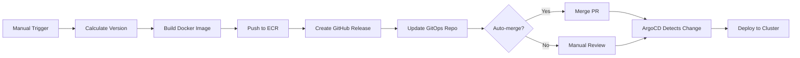

# GitOps Continuous Deployment Setup

Complete guide to setting up ArgoCD-based GitOps continuous deployment for Chores Tracker.

## Table of Contents

- [Overview](#overview)
- [Prerequisites](#prerequisites)
- [Architecture](#architecture)
- [ArgoCD Installation](#argocd-installation)
- [Repository Structure](#repository-structure)
- [Application Configuration](#application-configuration)
- [GitHub Actions Integration](#github-actions-integration)
- [Secrets Management](#secrets-management)
- [Multi-Environment Setup](#multi-environment-setup)
- [Deployment Workflow](#deployment-workflow)
- [Monitoring and Observability](#monitoring-and-observability)
- [Troubleshooting](#troubleshooting)

## Overview

Chores Tracker uses a GitOps deployment model with ArgoCD for continuous delivery:

**GitOps Principles:**
- **Declarative**: All infrastructure defined in Git
- **Versioned**: Complete audit trail of all changes
- **Immutable**: Changes via Git commits, not kubectl
- **Automated**: ArgoCD syncs changes automatically
- **Pull-based**: Cluster pulls from Git, not pushed to

**Deployment Flow:**
```
Code Change → GitHub Actions → ECR Push → GitOps Update → ArgoCD Sync → Kubernetes Deploy
```

**Key Components:**
- **Application Repository**: `arigsela/chores-tracker` (this repo)
- **GitOps Repository**: `arigsela/kubernetes` (deployment manifests)
- **CI/CD**: GitHub Actions workflows
- **CD Tool**: ArgoCD running in Kubernetes
- **Image Registry**: AWS ECR

## Prerequisites

Before setting up GitOps deployment, ensure you have:

**Required:**
- Kubernetes cluster (EKS, GKE, or other) with kubectl access
- GitHub account with admin access to repositories
- AWS account with ECR registry
- Domain name with DNS access (for ingress)

**Tools:**
- `kubectl` v1.24+
- `helm` v3.0+
- `git`
- `aws` CLI (for ECR)

**Access:**
- Cluster admin permissions
- GitHub Personal Access Token (PAT) with repo access
- AWS credentials for ECR

## Architecture

### GitOps Repository Structure

The `arigsela/kubernetes` repository contains all deployment manifests:

```
arigsela/kubernetes/
├── base-apps/
│   ├── chores-tracker-backend/
│   │   ├── deployment.yaml          # Backend deployment (2 replicas)
│   │   ├── service.yaml              # ClusterIP service on port 8000
│   │   ├── configmap.yaml            # Non-sensitive configuration
│   │   ├── migration-job.yaml        # Database migration job
│   │   └── secrets.yaml.example      # Template for secrets
│   └── chores-tracker-frontend/
│       ├── deployments.yaml          # Frontend deployment (2 replicas)
│       ├── service.yaml              # ClusterIP service on port 80
│       └── ingress.yaml              # NGINX ingress with TLS
├── argocd-apps/
│   ├── chores-tracker-backend.yaml   # ArgoCD Application resource
│   └── chores-tracker-frontend.yaml  # ArgoCD Application resource
└── README.md
```

**Separation of Concerns:**
- Application code: `arigsela/chores-tracker`
- Deployment manifests: `arigsela/kubernetes`
- CI builds images, CD deploys them

### Sync Wave Architecture

ArgoCD sync waves ensure proper deployment order:

```
Wave 0: ConfigMaps and Secrets
  ├── chores-tracker-backend-config
  └── chores-tracker-backend-secrets

Wave 1: Migration Job (PreSync Hook)
  └── chores-tracker-migration
      ├── Runs Alembic migrations
      └── Must complete before deployment

Wave 2: Application Deployments
  ├── chores-tracker-backend (2 replicas)
  └── chores-tracker-frontend (2 replicas)

Wave 3: Services and Ingress
  ├── Backend service (ClusterIP :8000)
  ├── Frontend service (ClusterIP :80)
  └── Frontend ingress (HTTPS)
```

**Annotations:**
```yaml
annotations:
  argocd.argoproj.io/sync-wave: "1"              # Execution order
  argocd.argoproj.io/hook: PreSync               # Hook type
  argocd.argoproj.io/hook-delete-policy: BeforeHookCreation
```

## ArgoCD Installation

### Install ArgoCD in Kubernetes

**1. Create ArgoCD namespace:**
```bash
kubectl create namespace argocd
```

**2. Install ArgoCD using official manifests:**
```bash
# Install ArgoCD
kubectl apply -n argocd -f https://raw.githubusercontent.com/argoproj/argo-cd/stable/manifests/install.yaml

# Wait for ArgoCD to be ready
kubectl wait --for=condition=available --timeout=300s \
  deployment/argocd-server -n argocd
```

**3. Access ArgoCD UI:**
```bash
# Port forward to access locally
kubectl port-forward svc/argocd-server -n argocd 8080:443

# Get initial admin password
kubectl -n argocd get secret argocd-initial-admin-secret \
  -o jsonpath="{.data.password}" | base64 -d; echo

# Login to ArgoCD UI
# URL: https://localhost:8080
# Username: admin
# Password: (from command above)
```

**4. Install ArgoCD CLI (optional but recommended):**
```bash
# macOS
brew install argocd

# Linux
curl -sSL -o /usr/local/bin/argocd https://github.com/argoproj/argo-cd/releases/latest/download/argocd-linux-amd64
chmod +x /usr/local/bin/argocd

# Login via CLI
argocd login localhost:8080 --username admin --password <password> --insecure
```

**5. Change default admin password:**
```bash
argocd account update-password
```

### Configure ArgoCD for Production

**1. Enable auto-sync and self-healing:**
```bash
# Configure via CLI
argocd app set <app-name> \
  --sync-policy automated \
  --self-heal \
  --auto-prune
```

**2. Configure RBAC (optional):**

Create `argocd-rbac-cm` ConfigMap:
```yaml
apiVersion: v1
kind: ConfigMap
metadata:
  name: argocd-rbac-cm
  namespace: argocd
data:
  policy.default: role:readonly
  policy.csv: |
    p, role:deployment-admin, applications, *, */*, allow
    g, deployment-team, role:deployment-admin
```

**3. Configure notifications (optional):**
```bash
# Install ArgoCD Notifications
kubectl apply -n argocd -f https://raw.githubusercontent.com/argoproj-labs/argocd-notifications/stable/manifests/install.yaml
```

## Repository Structure

### GitOps Repository Setup

**1. Clone the GitOps repository:**
```bash
git clone https://github.com/arigsela/kubernetes.git
cd kubernetes
```

**2. Copy templates from application repository:**
```bash
# From chores-tracker repo
cd /path/to/chores-tracker

# Copy backend manifests
cp -r gitops-templates/base-apps/chores-tracker-backend \
  /path/to/kubernetes/base-apps/

# Copy frontend manifests
cp -r gitops-templates/base-apps/chores-tracker-frontend \
  /path/to/kubernetes/base-apps/
```

**3. Create secrets (do NOT commit these):**
```bash
cd /path/to/kubernetes/base-apps/chores-tracker-backend

# Create secrets from template
cp secrets.yaml.example secrets.yaml

# Edit secrets with actual values
vim secrets.yaml
```

**4. Update environment-specific values:**

Edit `base-apps/chores-tracker-backend/configmap.yaml`:
```yaml
apiVersion: v1
kind: ConfigMap
metadata:
  name: chores-tracker-backend-config
  namespace: chores-tracker-backend
data:
  DATABASE_HOST: "mysql-service"
  DATABASE_PORT: "3306"
  DATABASE_NAME: "chores_tracker"
  ENVIRONMENT: "production"
```

Edit `base-apps/chores-tracker-frontend/ingress.yaml`:
```yaml
spec:
  tls:
  - hosts:
    - chores.yourdomain.com  # UPDATE THIS
    secretName: chores-frontend-tls
  rules:
  - host: chores.yourdomain.com  # UPDATE THIS
```

**5. Apply secrets manually (one-time):**
```bash
# Create namespace
kubectl create namespace chores-tracker-backend

# Apply secrets (NOT managed by ArgoCD for security)
kubectl apply -f base-apps/chores-tracker-backend/secrets.yaml

# Verify
kubectl get secrets -n chores-tracker-backend
```

## Application Configuration

### Create ArgoCD Application for Backend

**1. Create ArgoCD Application manifest:**

`argocd-apps/chores-tracker-backend.yaml`:
```yaml
apiVersion: argoproj.io/v1alpha1
kind: Application
metadata:
  name: chores-tracker-backend
  namespace: argocd
  finalizers:
    - resources-finalizer.argocd.argoproj.io
spec:
  project: default

  # Source repository
  source:
    repoURL: https://github.com/arigsela/kubernetes
    targetRevision: main
    path: base-apps/chores-tracker-backend

  # Destination cluster
  destination:
    server: https://kubernetes.default.svc
    namespace: chores-tracker-backend

  # Sync policy
  syncPolicy:
    automated:
      prune: true        # Delete resources when removed from Git
      selfHeal: true     # Auto-sync when cluster state drifts
      allowEmpty: false  # Prevent deletion of all resources

    syncOptions:
      - CreateNamespace=true  # Auto-create namespace
      - PruneLast=true        # Prune after successful sync

    retry:
      limit: 5
      backoff:
        duration: 5s
        factor: 2
        maxDuration: 3m

  # Ignore differences (for secrets managed outside ArgoCD)
  ignoreDifferences:
  - group: ""
    kind: Secret
    jsonPointers:
    - /data
```

**2. Apply ArgoCD Application:**
```bash
kubectl apply -f argocd-apps/chores-tracker-backend.yaml

# Check application status
argocd app get chores-tracker-backend

# Sync manually (first time)
argocd app sync chores-tracker-backend
```

### Create ArgoCD Application for Frontend

**1. Create frontend ArgoCD Application:**

`argocd-apps/chores-tracker-frontend.yaml`:
```yaml
apiVersion: argoproj.io/v1alpha1
kind: Application
metadata:
  name: chores-tracker-frontend
  namespace: argocd
  finalizers:
    - resources-finalizer.argocd.argoproj.io
spec:
  project: default

  source:
    repoURL: https://github.com/arigsela/kubernetes
    targetRevision: main
    path: base-apps/chores-tracker-frontend

  destination:
    server: https://kubernetes.default.svc
    namespace: default  # Or custom namespace

  syncPolicy:
    automated:
      prune: true
      selfHeal: true
    syncOptions:
      - CreateNamespace=true
```

**2. Apply and sync:**
```bash
kubectl apply -f argocd-apps/chores-tracker-frontend.yaml
argocd app sync chores-tracker-frontend
```

## GitHub Actions Integration

### GitHub Secrets Configuration

**Required GitHub Secrets:**

In repository settings > Secrets and variables > Actions, add:

| Secret Name | Description | Example |
|-------------|-------------|---------|
| `AWS_ACCESS_KEY_ID` | AWS credentials for ECR | `AKIA...` |
| `AWS_SECRET_ACCESS_KEY` | AWS secret key | `wJalrXU...` |
| `AWS_REGION` | AWS region for ECR | `us-east-2` |
| `ECR_REPOSITORY` | Backend ECR repository name | `chores-tracker` |
| `ECR_REPOSITORY_FRONTEND` | Frontend ECR repository | `chores-tracker-frontend` |
| `GITOPS_PAT` | GitHub PAT for GitOps repo | `ghp_...` |

**Creating GITOPS_PAT:**

1. Go to GitHub Settings > Developer settings > Personal access tokens
2. Generate new token (classic) with scopes:
   - `repo` (full repository access)
3. Copy token and add to GitHub Secrets as `GITOPS_PAT`

### CI/CD Workflow Overview

**Backend Release Workflow** (`.github/workflows/backend-release-and-deploy.yml`):



**Workflow Steps:**

1. **Trigger**: Manual workflow dispatch with version type
2. **Version Calculation**: Semantic versioning (major.minor.patch)
3. **Build**: Docker image with multi-architecture support
4. **Push to ECR**: Multiple tags (version, major, latest, sha)
5. **GitHub Release**: Create release with changelog
6. **GitOps Update**: Update manifest in `arigsela/kubernetes`
7. **PR Creation**: Automated PR with deployment details
8. **ArgoCD Sync**: Auto-deploys when PR merged

### Deployment Manifest Update

The workflow automatically updates image tags in GitOps repo:

**Before (in `kubernetes` repo):**
```yaml
image: 852893458518.dkr.ecr.us-east-2.amazonaws.com/chores-tracker:1.0.0
```

**After workflow runs:**
```yaml
image: 852893458518.dkr.ecr.us-east-2.amazonaws.com/chores-tracker:1.1.0
```

**Update Logic:**
```bash
# Extract base image URL
BASE_IMAGE=$(echo "$CURRENT_IMAGE" | cut -d':' -f1)

# Update tag using sed
sed -i "s|image: ${BASE_IMAGE}:[^[:space:]]*|image: ${BASE_IMAGE}:${NEW_VERSION}|" \
  base-apps/chores-tracker-backend/deployment.yaml
```

### Running a Release

**1. Trigger backend release:**
```bash
# Via GitHub UI
# Go to Actions > Release and Deploy > Run workflow
# Select:
#   - Release type: minor/major/patch/custom
#   - Update GitOps: true
#   - Auto-merge: false (recommended)
```

**2. Workflow creates PR in GitOps repo:**
```
Title: chore: update chores-tracker-backend to v1.1.0

Body:
## Deployment Update
This PR updates the chores-tracker-backend deployment to version v1.1.0.

### Changes
- Updated deployment container image tag to version 1.1.0

### Release Information
- Release URL: https://github.com/arigsela/chores-tracker/releases/tag/v1.1.0

### Deployment Checklist
- [x] Image successfully pushed to ECR
- [ ] Application deployment rolls out successfully
- [ ] Health checks passing
```

**3. Review and merge PR:**
```bash
# Review changes in GitHub UI
# Merge PR via GitHub

# Or via CLI
cd /path/to/kubernetes
gh pr review <PR_NUMBER> --approve
gh pr merge <PR_NUMBER> --merge
```

**4. ArgoCD auto-syncs:**
```bash
# Monitor deployment
argocd app get chores-tracker-backend

# Watch in UI
open https://argocd.yourdomain.com/applications/chores-tracker-backend

# Check rollout status
kubectl rollout status deployment/chores-tracker-backend \
  -n chores-tracker-backend
```

## Secrets Management

### Kubernetes Secrets (Manual Management)

**Backend Secrets** (`chores-tracker-backend-secrets`):

```yaml
apiVersion: v1
kind: Secret
metadata:
  name: chores-tracker-backend-secrets
  namespace: chores-tracker-backend
type: Opaque
stringData:
  DATABASE_USER: "root"
  DATABASE_PASSWORD: "your-secure-password"
  SECRET_KEY: "your-jwt-secret-key-min-32-chars"
  MYSQL_ROOT_PASSWORD: "your-mysql-root-password"
```

**Apply secrets (NOT committed to Git):**
```bash
# Store secrets in secure location (e.g., password manager)
# Apply to cluster
kubectl apply -f secrets.yaml

# Verify
kubectl get secret chores-tracker-backend-secrets \
  -n chores-tracker-backend -o yaml
```

### Sealed Secrets (Recommended for Production)

For GitOps-friendly secret management, use Sealed Secrets:

**1. Install Sealed Secrets controller:**
```bash
kubectl apply -f https://github.com/bitnami-labs/sealed-secrets/releases/download/v0.18.0/controller.yaml

# Install kubeseal CLI
brew install kubeseal  # macOS
```

**2. Encrypt secrets:**
```bash
# Create regular secret
kubectl create secret generic chores-tracker-backend-secrets \
  --from-literal=DATABASE_PASSWORD=mysecret \
  --dry-run=client -o yaml > secret.yaml

# Seal the secret
kubeseal -f secret.yaml -w sealed-secret.yaml

# Commit sealed secret to Git
git add sealed-secret.yaml
git commit -m "Add sealed secrets"
```

**3. Update ArgoCD to manage sealed secrets:**
```yaml
# In base-apps/chores-tracker-backend/sealed-secret.yaml
apiVersion: bitnami.com/v1alpha1
kind: SealedSecret
metadata:
  name: chores-tracker-backend-secrets
  namespace: chores-tracker-backend
spec:
  encryptedData:
    DATABASE_PASSWORD: AgBy3i4OJSWK+PiTySY...  # Encrypted
```

### External Secrets Operator (Alternative)

For integration with AWS Secrets Manager, Vault, etc.:

```bash
# Install External Secrets Operator
helm repo add external-secrets https://charts.external-secrets.io
helm install external-secrets \
  external-secrets/external-secrets \
  -n external-secrets-system \
  --create-namespace
```

## Multi-Environment Setup

### Environment Structure

```
arigsela/kubernetes/
├── environments/
│   ├── dev/
│   │   ├── chores-tracker-backend/
│   │   │   ├── kustomization.yaml
│   │   │   └── configmap-patch.yaml
│   │   └── chores-tracker-frontend/
│   ├── staging/
│   │   └── ...
│   └── prod/
│       └── ...
└── base-apps/  # Base manifests
```

### Using Kustomize for Environments

**Base manifests** (shared across environments):
```yaml
# base-apps/chores-tracker-backend/kustomization.yaml
apiVersion: kustomize.config.k8s.io/v1beta1
kind: Kustomization

resources:
- deployment.yaml
- service.yaml
- configmap.yaml
- migration-job.yaml

namespace: chores-tracker-backend
```

**Environment overlay** (dev-specific):
```yaml
# environments/dev/chores-tracker-backend/kustomization.yaml
apiVersion: kustomize.config.k8s.io/v1beta1
kind: Kustomization

bases:
- ../../../base-apps/chores-tracker-backend

namespace: chores-tracker-backend-dev

patchesStrategicMerge:
- configmap-patch.yaml

# Reduce replicas in dev
replicas:
- name: chores-tracker-backend
  count: 1
```

**ConfigMap patch for dev:**
```yaml
# environments/dev/chores-tracker-backend/configmap-patch.yaml
apiVersion: v1
kind: ConfigMap
metadata:
  name: chores-tracker-backend-config
data:
  ENVIRONMENT: "development"
  LOG_LEVEL: "DEBUG"
```

**ArgoCD Application for dev:**
```yaml
apiVersion: argoproj.io/v1alpha1
kind: Application
metadata:
  name: chores-tracker-backend-dev
  namespace: argocd
spec:
  source:
    repoURL: https://github.com/arigsela/kubernetes
    targetRevision: main
    path: environments/dev/chores-tracker-backend
  destination:
    namespace: chores-tracker-backend-dev
```

## Deployment Workflow

### Standard Deployment Process

**1. Code changes:**
```bash
# Developer makes changes
git checkout -b feature/new-feature
# ... make changes ...
git commit -m "feat: add new feature"
git push origin feature/new-feature

# Create PR, review, merge to main
```

**2. Trigger release:**
```bash
# Go to GitHub Actions
# Run "Release and Deploy" workflow
# Select version type: minor
# Enable: Update GitOps
# Disable: Auto-merge (for safety)
```

**3. Workflow execution:**
- Builds Docker image
- Pushes to ECR with tags
- Creates GitHub release
- Updates GitOps repo deployment manifest
- Creates PR in `arigsela/kubernetes`

**4. Review GitOps PR:**
```bash
# Review the PR in arigsela/kubernetes
# Check:
# - Image tag is correct
# - No unintended changes
# - Deployment strategy looks good

# Merge PR
```

**5. ArgoCD syncs:**
```bash
# ArgoCD detects Git change
# Runs sync waves in order:
#   Wave 0: ConfigMaps/Secrets
#   Wave 1: Migration job
#   Wave 2: Deployment

# Monitor in ArgoCD UI or CLI
argocd app get chores-tracker-backend --refresh
argocd app wait chores-tracker-backend --health
```

**6. Verify deployment:**
```bash
# Check pod status
kubectl get pods -n chores-tracker-backend

# Check logs
kubectl logs -f deployment/chores-tracker-backend \
  -n chores-tracker-backend

# Test health endpoint
kubectl port-forward svc/chores-tracker-backend 8000:8000 \
  -n chores-tracker-backend
curl http://localhost:8000/health
```

### Rollback Procedure

**Option 1: Rollback via ArgoCD (preferred):**
```bash
# List history
argocd app history chores-tracker-backend

# Rollback to previous revision
argocd app rollback chores-tracker-backend <REVISION>

# Or rollback in UI
# Application > History > Rollback
```

**Option 2: Revert Git commit:**
```bash
cd /path/to/kubernetes
git log base-apps/chores-tracker-backend/deployment.yaml

# Revert to previous commit
git revert <commit-hash>
git push origin main

# ArgoCD auto-syncs to reverted state
```

**Option 3: Manual kubectl (emergency only):**
```bash
# Roll back deployment
kubectl rollout undo deployment/chores-tracker-backend \
  -n chores-tracker-backend

# Note: ArgoCD will detect drift and may re-sync
# Disable auto-sync first if using this method
```

### Hotfix Deployment

For urgent fixes:

```bash
# 1. Create hotfix branch
git checkout -b hotfix/critical-fix

# 2. Make fix, test locally
# ... fix code ...

# 3. Merge to main quickly
git commit -m "fix: critical security issue"
git push origin hotfix/critical-fix
# Fast-track PR review and merge

# 4. Immediate release
# Run workflow with:
#   - Release type: patch
#   - Auto-merge: true (for speed)
#   - Update GitOps: true

# 5. Monitor deployment closely
argocd app wait chores-tracker-backend --health --timeout 300
```

## Monitoring and Observability

### ArgoCD Application Health

**Health Status:**
- **Healthy**: All resources running as expected
- **Progressing**: Deployment in progress
- **Degraded**: Some resources unhealthy
- **Suspended**: Application sync suspended
- **Missing**: Resources not found in cluster

**Check health:**
```bash
# CLI
argocd app get chores-tracker-backend --refresh

# Expected output:
# Health Status: Healthy
# Sync Status: Synced
```

### Sync Status Monitoring

**Sync States:**
- **Synced**: Cluster matches Git
- **OutOfSync**: Cluster state differs from Git
- **Unknown**: Unable to determine sync status

**Monitor sync:**
```bash
# Watch for sync issues
argocd app watch chores-tracker-backend

# Force sync if needed
argocd app sync chores-tracker-backend --force
```

### Deployment Metrics

**ArgoCD Metrics:**
```bash
# Port forward to ArgoCD metrics
kubectl port-forward svc/argocd-metrics -n argocd 8082:8082

# Query Prometheus metrics
curl http://localhost:8082/metrics | grep argocd_app

# Key metrics:
# - argocd_app_info{name="chores-tracker-backend"}
# - argocd_app_sync_total
# - argocd_app_k8s_request_total
```

**Application Metrics:**
```bash
# Backend Prometheus metrics
kubectl port-forward svc/chores-tracker-backend 8000:8000 \
  -n chores-tracker-backend
curl http://localhost:8000/metrics
```

### Notifications Setup

**Configure Slack notifications:**

```yaml
# argocd-notifications-cm ConfigMap
apiVersion: v1
kind: ConfigMap
metadata:
  name: argocd-notifications-cm
  namespace: argocd
data:
  service.slack: |
    token: $slack-token

  template.app-deployed: |
    message: |
      Application {{.app.metadata.name}} has been deployed!
      Sync Status: {{.app.status.sync.status}}
      Health: {{.app.status.health.status}}

  trigger.on-deployed: |
    - when: app.status.operationState.phase in ['Succeeded']
      send: [app-deployed]
```

**Subscribe application to notifications:**
```yaml
# In Application manifest
metadata:
  annotations:
    notifications.argoproj.io/subscribe.on-deployed.slack: deployments-channel
```

## Troubleshooting

### Common Issues

**1. ArgoCD shows "OutOfSync" but no changes in Git:**

```bash
# Check for manual kubectl changes
kubectl get deployment chores-tracker-backend \
  -n chores-tracker-backend -o yaml | grep image

# If image tag differs from Git, either:
# A) Let ArgoCD self-heal (if enabled)
argocd app sync chores-tracker-backend

# B) Update Git to match cluster
cd /path/to/kubernetes
# Edit deployment.yaml to match cluster state
git commit -m "chore: sync deployment state"
git push
```

**2. Migration job fails:**

```bash
# Check job logs
kubectl logs job/chores-tracker-migration \
  -n chores-tracker-backend

# Common issues:
# - Database not ready: increase initialDelaySeconds
# - Connection refused: check DATABASE_HOST in ConfigMap
# - Permission denied: check DATABASE_USER secret

# Delete failed job (ArgoCD will recreate on next sync)
kubectl delete job chores-tracker-migration \
  -n chores-tracker-backend
```

**3. Sync takes too long:**

```bash
# Check ArgoCD controller logs
kubectl logs -n argocd deployment/argocd-application-controller

# Check sync timeout settings
argocd app get chores-tracker-backend -o yaml | grep timeout

# Increase timeout if needed
argocd app set chores-tracker-backend \
  --sync-option Timeout=600
```

**4. "Resource quota exceeded" errors:**

```bash
# Check resource usage
kubectl top pods -n chores-tracker-backend

# Check quotas
kubectl describe resourcequota -n chores-tracker-backend

# Adjust deployment resources or quota
```

**5. Image pull errors:**

```bash
# Check ECR credentials
kubectl get secret -n chores-tracker-backend

# Verify image exists in ECR
aws ecr describe-images \
  --repository-name chores-tracker \
  --image-ids imageTag=1.1.0 \
  --region us-east-2

# Check image pull policy
kubectl get deployment chores-tracker-backend \
  -n chores-tracker-backend -o yaml | grep imagePullPolicy
# Should be: Always
```

### Debug Commands

**Application diagnostics:**
```bash
# Full app details
argocd app get chores-tracker-backend -o yaml

# Application events
kubectl get events -n chores-tracker-backend \
  --sort-by='.lastTimestamp'

# Resource tree
argocd app resources chores-tracker-backend
```

**Sync debugging:**
```bash
# Dry run sync
argocd app sync chores-tracker-backend --dry-run

# Diff against Git
argocd app diff chores-tracker-backend

# Force sync (ignore warnings)
argocd app sync chores-tracker-backend \
  --force \
  --replace
```

**Manual intervention:**
```bash
# Temporarily disable auto-sync for debugging
argocd app set chores-tracker-backend \
  --sync-policy none

# Make manual changes for testing
kubectl edit deployment chores-tracker-backend \
  -n chores-tracker-backend

# Re-enable auto-sync when done
argocd app set chores-tracker-backend \
  --sync-policy automated
```

## Best Practices

**1. Git Workflow:**
- Never commit secrets to Git
- Use feature branches for infrastructure changes
- Require PR reviews for GitOps repo
- Tag releases in both repos

**2. Sync Configuration:**
- Enable auto-sync for non-production environments
- Use manual sync for production (or with approval)
- Enable self-heal for config drift detection
- Set appropriate retry limits

**3. Security:**
- Use Sealed Secrets or External Secrets Operator
- Limit ArgoCD RBAC permissions
- Enable audit logging
- Rotate secrets regularly

**4. Monitoring:**
- Set up ArgoCD notifications
- Monitor sync status in dashboards
- Alert on sync failures
- Track deployment frequency

**5. Testing:**
- Test manifest changes in dev environment first
- Use `kubectl diff` before applying changes
- Validate manifests with CI checks
- Keep rollback procedures documented

## Next Steps

After setting up GitOps CD:

1. **Configure monitoring**: See [monitoring-account-setup.md](./monitoring-account-setup.md)
2. **Set up environments**: Create dev/staging/prod overlays
3. **Enable notifications**: Configure Slack/email alerts
4. **Document runbooks**: Create operational procedures
5. **Train team**: Ensure everyone understands GitOps workflow

## Related Documentation

- [Kubernetes Deployment Guide](./KUBERNETES.md) - Detailed K8s configuration
- [Frontend Deployment Setup](./frontend-deployment-setup.md) - React Native Web deployment
- [GitOps Deployment Analysis](./GITOPS_DEPLOYMENT_ANALYSIS.md) - Architecture deep dive
- [Release Process](./RELEASING.md) - Version management and releases
